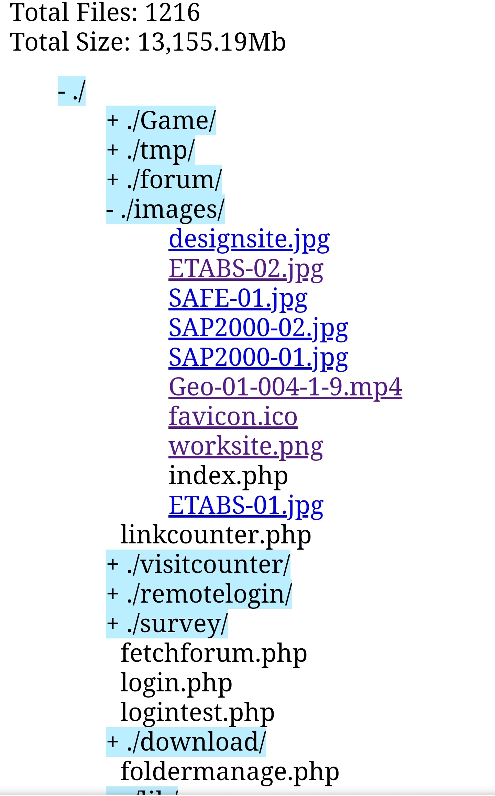
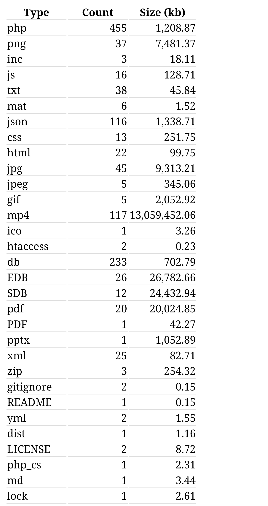

# Folder-Informations
Traverse the folder recursively and collect the several informations such as number of files count and size for each file type.
Produce html tree using list elements and links to view some text, video and image files.

## Example use

First include the `FolderInfo.php` class in your file, and use the class as following to generate the HTML for the math expressions:

```
$folderinfo = new FolderInfo();
$folderinfo->printAll();
```

## Tree list of folder content


## Table of file types, their size and count in total

